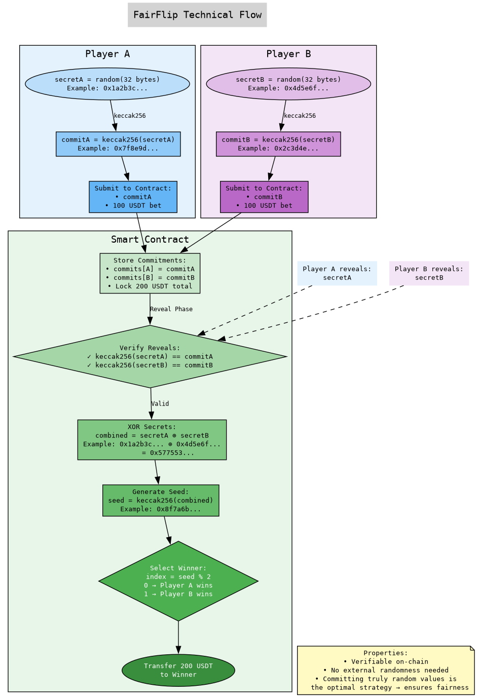

# FairFlip 🎲

**A trustless, on-chain coin flip game where cryptography ensures fairness—no oracle needed.**

FairFlip lets 2-16 players bet USDT in a winner-takes-all game. The winner is determined through a commit-reveal scheme with XOR-based randomness that makes cheating impossible and true randomness the only winning strategy.

## Core Concept

Players commit hashed secrets → Everyone reveals → XOR all secrets → Hash the result → Winner selected

Since committing random values is the optimal strategy for every player, the game remains fair without trusting anyone or anything external.



## How It Works

### 1. **Commit Phase**
Players generate a random 32-byte secret and submit its hash (commitment) along with their bet. The secret stays private—only the hash goes on-chain.

### 2. **Join & Lock**
Players join by submitting their commitment and matching the bet amount. Once the game fills (2-16 players), it locks—no new players, no backing out. Your commitment is your bond.

### 3. **Reveal Phase**
Players reveal their secrets within the time limit (configurable: 1 minute to 2 hours). The contract verifies each reveal matches its commitment. Miss the deadline? You forfeit.

### 4. **Settlement**
The contract XORs all revealed secrets together, creating a combined value that no single player could predict. This gets hashed to generate a random seed, which selects the winner from those who revealed.

```solidity
combined = secret1 ⊕ secret2 ⊕ ... ⊕ secretN
seed = keccak256(combined)
winner = revealers[seed % numRevealers]
```

### 5. **Payout**
Winner takes all. Non-revealers lose their bets to the pot, incentivizing honest participation.

## Why It's Fair

- **Game Theory**: Submitting truly random values is the dominant strategy—any pattern makes you predictable
- **Cryptographic Security**: Commit-reveal prevents anyone from changing their value after seeing others
- **No External Dependencies**: No oracles, no VRF services, no trust assumptions beyond Ethereum itself
- **Transparent**: All operations verifiable on-chain

## Security Features

- **ReentrancyGuard**: Prevents reentrancy attacks
- **No Cancellations**: Once committed, you can't back out after seeing others' reveals
- **Time Bounds**: Reveal phase has strict deadlines to prevent stalling
- **Emergency Refund**: If game gets stuck, players can reclaim funds after 7 days
- **Input Validation**: All parameters checked for safety ranges

## Technical Stack

- **Smart Contracts**: Solidity 0.8.20
- **Token**: USDT (or any ERC20)
- **Network**: Arbitrum (low fees, fast finality)
- **Development**: Hardhat, Ethers.js v6
- **Testing**: Comprehensive test suite with mainnet fork testing

## Quick Start

### Prerequisites
```bash
npm install
cp .env.example .env  # Add your private key and RPC URLs
```

### Testing
```bash
# Run tests with mainnet fork
npx hardhat test

# Run with gas reporting
REPORT_GAS=true npx hardhat test
```

### Deployment

Deploy to Arbitrum:
```bash
npx hardhat run scripts/deploy.js --network arbitrum
```

Deploy mock USDT for testing:
```bash
npx hardhat run scripts/deploy-mock-usdt.js --network arbitrumSepolia
```

## Contract Interface

### For Players

```solidity
// Create a new game
function createGame(
    bytes32 commitHash,     // keccak256(secret)
    uint256 betAmount,      // USDT amount to bet
    uint256 maxPlayers,     // 2-16 players
    uint256 revealDuration  // 60-7200 seconds
)

// Join existing game
function joinGame(
    address creator,
    bytes32 commitHash
)

// Reveal your secret
function reveal(
    address creator,
    bytes32 secret
)

// Trigger settlement (after reveal deadline)
function settle(address creator)
```

### View Functions

```solidity
// Get game state
function getGameInfo(address creator) returns (
    uint256 betAmount,
    uint256 maxPlayers,
    uint256 currentPlayers,
    uint256 revealDuration,
    uint256 revealDeadline,
    bool isActive,
    bool isRevealing
)

// Check if player revealed
function hasPlayerRevealed(address creator, address player) returns (bool)

// Get list of players
function getGamePlayers(address creator) returns (address[])
```

## Game Theory Analysis

FairFlip creates a fascinating game-theoretic environment:

1. **Commitment Binding**: Once you commit, you're locked in—no strategic withdrawal
2. **Reveal Incentive**: Not revealing means losing your bet with 100% certainty
3. **Randomness Optimal**: Any non-random pattern in your secret can be exploited
4. **Nash Equilibrium**: All players committing truly random values

The beauty is that selfish, rational play leads to a fair game for everyone.

## Gas Optimization

- Efficient storage packing in Game struct
- Cleanup function resets storage for gas refunds
- Batch operations where possible
- Events for off-chain indexing instead of storage

## Auditing Considerations

Key areas reviewed for security:
- Reentrancy protection on all external calls
- Integer overflow/underflow (handled by Solidity 0.8+)
- Front-running resistance through commit-reveal
- DoS resistance with time bounds and emergency functions
- Proper randomness generation without modulo bias

## License

[GPL-2.0](LICENSE)

## Contributing

Contributions are welcome!